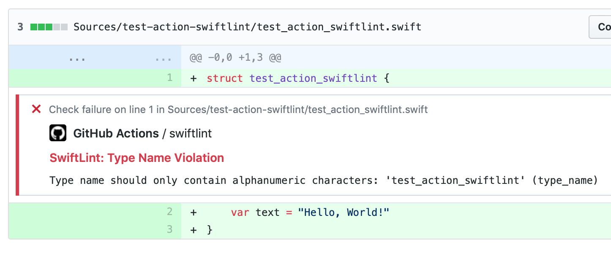

# GitHub Action for SwiftLint

This Action executes [SwiftLint](https://github.com/realm/SwiftLint) and generates annotations from SwiftLint Violations.

## Usage

An example workflow(`.github/workflows/swiftlint.yml`) to executing SwiftLint follows:

```yaml
name: SwiftLint

on:
  pull_request:
    paths:
      - '.github/workflows/swiftlint.yml'
      - '.swiftlint.yml'
      - '**/*.swift'

jobs:
  SwiftLint:
    runs-on: ubuntu-latest
    steps:
      - uses: actions/checkout@v1
      // Simple usage
      - name: GitHub Action for SwiftLint
        uses: norio-nomura/action-swiftlint@3.2.1
      // With custom argument
      - name: GitHub Action for SwiftLint with --strict
        uses: norio-nomura/action-swiftlint@3.2.1
        with:
          args: --strict
      // Only checks files changed in the PR
      - name: Fetch base ref
        run: |
          git fetch --prune --no-tags --depth=1 origin +refs/heads/${{ github.base_ref }}:refs/heads/${{ github.base_ref }}
      - name: GitHub Action for SwiftLint (Only files changed in the PR)
        uses: norio-nomura/action-swiftlint@3.2.1
        env:
          DIFF_BASE: ${{ github.base_ref }}
          DIFF_HEAD: HEAD
      // Runs on different workspace
      - name: GitHub Action for SwiftLint (Different working directory)
        uses: norio-nomura/action-swiftlint@3.2.1
        env:
          WORKING_DIRECTORY: Source
```

## Secrets

- ~~Specifying `GITHUB_TOKEN` to `secrets` is required to using [Check Run APIs](https://developer.github.com/v3/checks/runs/) for generating annotations from SwiftLint Violations.~~
- Since 3.0.0, `GITHUB_TOKEN` is no longer needed.

## Example
[Here](https://github.com/norio-nomura/test-action-swiftlint/pull/1/files) is an example that actually works.


## Author

Norio Nomura

## License

[MIT](LICENSE)
